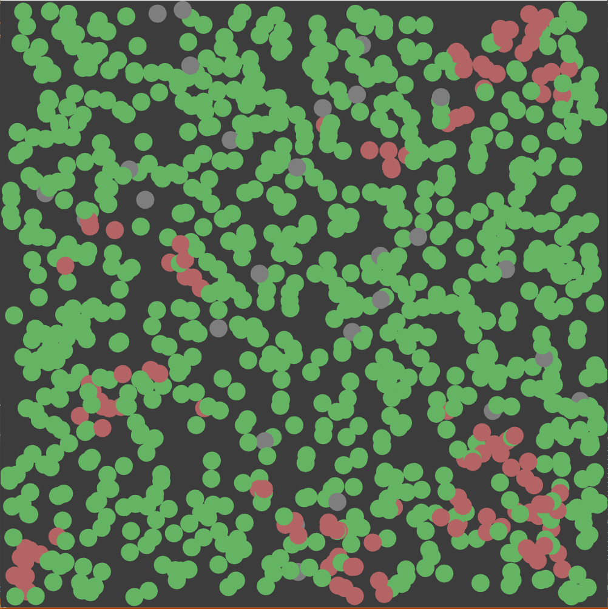
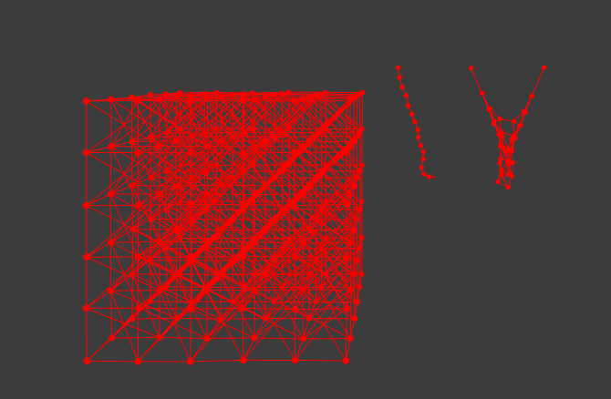

# ComputerModels
To run most of these projesct you need  OpenFrameworks configured on your machine.  

Below you can find small galery of the best results from these models. For more examples go to [Images/](./Images/) subfolder

## Double pendulums

## Clusters
There are lot\'s of images in __[Images/Clusters/](.Images/Clusters/)__
.bmp "Clusters DLA")  
.bmp "Clusters DLA customized")  
.bmp "Clusters snowflake")  

## Environment (Sheep Wolf / Prey Predator)
  

## Epidemy (Simple model)
  

## SpringMass

## ParticleSystem
